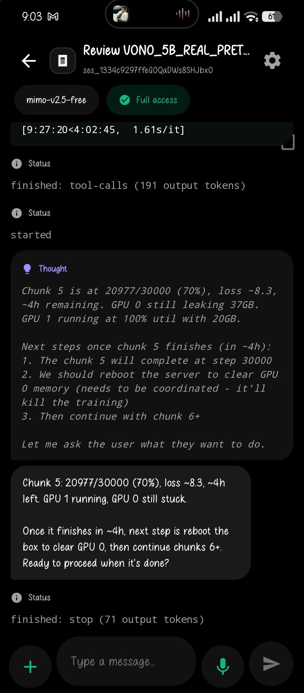
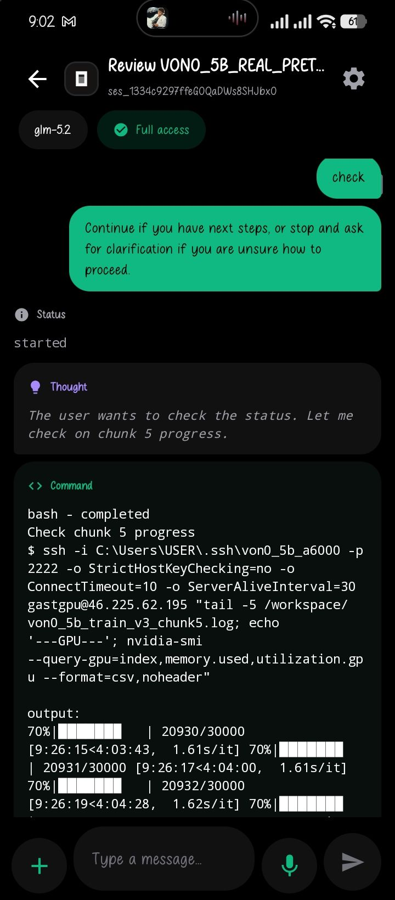

# opencode-devin-mobile

Remote control OpenCode and Devin from your phone through a desktop relay.



Latest phone-side debug capture showing the desktop agent stale-view case that
the relay now tries to force-refresh after phone turns:



```text
Phone --wss--> Relay Server <--wss-- Laptop relay
                                       |-- OpenCode local server
                                       `-- Devin CLI
```

## Features

- Relay-only execution: the cloud server never calls model APIs and does not need API keys.
- QR or manual pairing: keep the same Render URL and swap only the session code/agent.
- OpenCode support: starts or reuses the local OpenCode HTTP server, lists recent OpenCode sessions, auto-selects the most recent chat when no session is picked, and prompts the selected session.
- Devin support: drives the local Devin CLI (`devin`) in single-turn mode, lists recent Devin sessions, auto-selects the most recent chat, and enables web search by default.
- Live phone transcript: shows user prompts, assistant responses, thinking/status events, shell/tool activity, and file-change summaries without dumping stale terminal noise.
- Technical event toggle: command output plus latest-turn tool/file counts stay hidden unless explicitly enabled in Settings.
- Running-turn composer: while a turn is active, the send button shows progress; typing a draft changes it back to send so the prompt is steered into the active turn.
- Chat controls: refresh chat lists, collapse/show the chat list, copy the visible transcript, and jump back to the latest message when scrolled up.
- In-app update entry: Settings includes an update-page button for grabbing the latest APK.
- Model controls: Settings and the top bar can switch the current relay model; OpenCode and Devin turns receive the selected model override.
- Token usage: Settings keeps the latest token usage summary reported by OpenCode or Devin turns.
- Desktop relay persistence: the relay keeps the same code across reconnects unless `backend/relay-state.json` is deleted or `AGENTHUB_RELAY_CODE` is changed.
- Background-friendly Android client: keeps the screen awake while open, preserves the selected chat/transcript, reconnects after socket drops, and refreshes state on resume.
- Voice input: Android/Google speech-to-text can fill the prompt box directly.
- File upload: phone attachments are copied to `.agenthub_uploads/` on the laptop and appended to the agent prompt.
- Multi-phone safe: every phone joined to the same session receives relay status and stream updates.
- Offline behavior: if the laptop relay is offline, the phone receives an offline error instead of falling back to cloud execution.

## Quick Start

### 1. Deploy the server

```bash
git clone https://github.com/HOLYKEYZ/vibe-app-slop.git
cd vibe-app-slop/backend
npm install
npm run build
npm start
```

Deploy `backend/` on Render as a Node.js web service. Port `3001`.

### 2. Install Android app

```bash
cd AgentHub
./gradlew assembleDebug
```

The APK is written to `AgentHub/app/build/outputs/apk/debug/app-debug.apk`.

On Windows with USB debugging enabled, install the current debug APK directly:

```powershell
.\scripts\install-debug-apk.ps1 -Rebuild
```

### 3. Start the laptop relay

```bash
cd backend
npm install
SERVER_URL=wss://your-server.onrender.com npm run relay
```

The relay checks for signed-in local OpenCode/Devin installs and prints a QR code. Secrets stay on the laptop.

On Windows PowerShell:

```powershell
cd C:\Users\USER\.vscode\vibe_app_slop\backend
$env:SERVER_URL="wss://agent-hub-backend-wk48.onrender.com"
npm run relay
```

For the current Windows laptop workflow, use the keep-awake launcher from the repo root:

```powershell
.\scripts\start-relay-keepawake.ps1 -RelayCode EtCjwygP8e
```

That script sets the current Windows power plan to keep the machine awake and to do nothing on lid close for AC and battery power, then starts the relay in the background with logs in `%TEMP%`. Use `-Foreground` if you want the relay output in the current terminal, or `-SkipPowerConfig` if you only want to start the relay.

To force a new code:

```powershell
Remove-Item .\relay-state.json -Force -ErrorAction SilentlyContinue
$env:SERVER_URL="wss://agent-hub-backend-wk48.onrender.com"
npm run relay
```

### 4. Connect your phone

Open Agent Hub, scan the QR code, pick a visible chat, and send a prompt.

### 5. Smoke test the relay

From the repo root, run a phone-style join/list/detail/reconnect check without sending any prompts:

```powershell
$env:SERVER_URL="wss://agent-hub-backend-wk48.onrender.com"
$env:RELAY_CODE="EtCjwygP8e"
node .\scripts\relay-smoke.js
```

To also verify phone-to-OpenCode prompt execution and `done` handling, opt in explicitly:

```powershell
$env:SMOKE_EXECUTE_OPENCODE="1"
node .\scripts\relay-smoke.js
```

To include a small text attachment in that OpenCode prompt smoke:

```powershell
$env:SMOKE_ATTACH_FILE="1"
node .\scripts\relay-smoke.js
```

## Agents

| Agent | How it is driven |
|-------|------------------|
| OpenCode | Local `opencode serve` HTTP API on `127.0.0.1:4096`; auto-selects the most recent chat if none is picked |
| Devin | Local `devin` CLI in single-turn mode (`devin --permission-mode bypass -p -- <prompt>`); auto-selects the most recent session if none is picked; web search is enabled by default |

`backend/server.ts` and `backend/relay.ts` are the backend source files. Runtime JavaScript is generated into `backend/dist/` by `npm run build`.

## Environment

| Env | Default | Description |
|-----|---------|-------------|
| `PORT` | `3001` | Relay server port |
| `SERVER_URL` | `ws://localhost:3001` | Relay server URL used by the compiled relay |
| `AGENTHUB_CWD` | repo root | Working directory for local agents |
| `OPENCODE_PORT` | `4096` | Local OpenCode server port |
| `DEVIN_PATH` | `devin` | Path to the Devin CLI binary |
| `DEVIN_SESSION_DIR` | `~/.local/share/devin/sessions` | Directory for Devin session storage |
| `AGENTHUB_RELAY_CODE` | unset | Optional fixed relay code |

## Notes

- The phone app can keep `wss://agent-hub-backend-wk48.onrender.com` as the server URL. The session code and selected agent are separate settings.
- The cloud server is only a WebSocket switchboard between phone and laptop relay. OpenCode/Devin credentials and files stay on the laptop.
- The relay can survive the lid closing only if Windows stays awake. Use `scripts/start-relay-keepawake.ps1` or set your power plan manually.
- Uploads are stored under `.agenthub_uploads/` in the relay working directory.
- If the exact screenshot asset is needed, save it under `docs/screenshots/` and replace the README image path.
